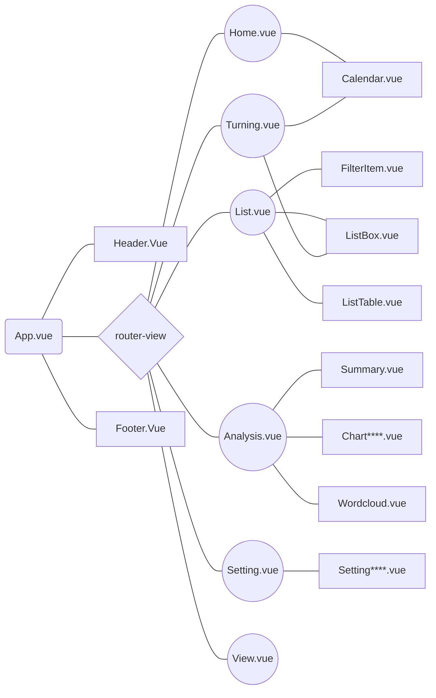

# Photo Calendar Review

> v2020.04.07
> https://photo-cal.netlify.com/

---
[toc]
---

## 1. 기술 스택
- 반응형 웹, [Sass](https://sass-guidelin.es/ko/)
- [Vue.js](https://kr.vuejs.org/), [Vue Router](https://router.vuejs.org/kr/), [Vuex](https://vuex.vuejs.org/kr/guide/)
- [Vue CLI](https://cli.vuejs.org/)
- [Chart.js](https://www.chartjs.org/), [vue-chartjs](https://vue-chartjs.org/)
- [xlsx](https://www.npmjs.com/package/xlsx) : Excel 파일(.xlsx)을 JSON 형식으로 변환
- [Netlify](https://www.netlify.com/)

---

## 2. 디렉토리 / 파일 구성
```
├── dist/
├── public/
│   ├── favicon.ico
│   ├── index.html                            # index.html template
│   └── sample.xlsx                           # 엑셀 샘플 파일
├── src/
│   ├── assets/
│   │   ├── icon/
│   │   │   ├── **/*.svg
│   │   ├── js/
│   │   │   ├── formatNumberComma.js
│   │   │   ├── utilColor.js
│   │   │   └── utilDate.js
│   │   ├── scss/
│   │   │   ├── **/*.scss
│   │   ├── logo.png
│   │   ├── logo.svg
│   │   ├── noimage.png
│   │   └── sample.json                        # 샘플 데이터
│   ├── components/                            # ui components
│   │   ├── **/*.vue
│   ├── router/
│   │   └── index.js
│   ├── store/
│   │   ├── getters.js
│   │   ├── index.js                          # 모듈을 조합하고 저장소를 내보내는 곳
│   │   ├── mutations.js
│   │   └── state.js
│   ├── views/
│   │   ├── Analysis.vue
│   │   ├── Home.vue
│   │   ├── List.vue
│   │   ├── Setting.vue
│   │   ├── Turning.vue
│   │   └── View.vue
│   ├── App.vue                               # main app component
│   └── main.js                               # app entry file
├── .editorconfig
├── .gitignore
├── babel.config.js
├── netlify.toml
├── package.json
├── README.md
├── REVIEW.md
└── .yarn.lock
```

### components 파일 구성
```
└── components/
    ├── layout/
    │   ├── Header.vue
    │   └── Footer.vue
    ├── index.html
    ├── Calendar.vue
    ├── ChartAmount.vue
    ├── ChartCategory.vue
    ├── ChartViewingDay.vue
    ├── ChartVisits.vue
    ├── FilterItem.vue
    ├── ListBox.vue
    ├── ListTable.vue
    ├── SettingChartColor.vue
    ├── SettingColor.vue
    ├── SettingFont.vue
    ├── SettingPoster.vue
    ├── SettingTheme.vue
    ├── SettingUserData.vue
    ├── Summary.vue
    └── Wordcloud.vue
```

### 구조

---

## 3. 페이지별 기능

### ⚙️ 설정
#### 데이터
- DB를 insert update delete 과정없이 json 하나로
- 엑셀 데이터를 [Excel To Json Converter](http://beautifytools.com/excel-to-json-converter.php)를 사용해 json으로 변환해서 개발
  - 다른 온라인 컨버터의 경우 한글, 날짜 등 변환 문제가 있었음
- 엑셀파일을 불러와서 데이터 변경
- 분류, 배우의 경우 엑셀변환 과정에 문제가 있어 콤마(,)가 아닌 슬래시(/)로 구분
  - e.g) 드라마,멜로 (❌) 드라마/멜로 (⭕️)

#### 디자인
- 구글 웹폰트 사용
- 다크테마는 역시 손이 많이 감
- 아이콘 svg 파일을 사용

### 📅 캘린더
- 컴포넌트 활용의 좋은 예
- 월별보기, 연도별보기, 다관람 페이지 - 작품별 보기
- 포스터 보기 방식 `object-position` 속성 활용

### 📝 목록, 상세, 다관람
- 뷰 페이지로 이동 후 검색 조건이 초기화 됨 -> vuex의 필요성
- 필터, 리스트 뷰타입, 테이블 뷰타입 컴포넌트를 분리하니 좋아짐
- 검색 기능으로 대부분의 기능은 가능했으나 다람과 페이지 추가로 기능이 커짐
- 빈약한 상세페이지를 하나의 이미지로 활용 방법 고민

### 📊 통계
- 처음엔 [vue-chart-js](https://www.npmjs.com/package/vue-chart-js)를 사용했으나 데이터에 따라 차트가 다시 랜더링 되지 않아 [vue-chartjs](https://www.npmjs.com/package/vue-chartjs) 로 변경
- 색상, 폰트 적용, 가격에 콤마 표시

---

## 4. 특이사항

### Vue CLI
- 18년 초반에 cli2 과 구조 등 변경 사항 많음
- 명령어 `vue init webpack my-project` 에서 `vue create my-project` 로 바뀜
- sass 설정 추가로 하지 않아도 돼서 좋음
- root에 `vue.config.js` 파일 생성하여 설정
- 샘플 엑셀파일 제공 경로. static 폴더를 사용했던 걸 public 폴더로 사용

### ESLint rules
- 재사용하지 않는 변수의 경우 const로
- 변수 상단에 모아서 선언
- 줄바꿈 여러 번 있을 때 에러
- v-if와 v-for를 함께 사용하지 않음
    - [https://kr.vuejs.org/v2/style-guide/#v-if와-v-for를-동시에-사용하지-마세요-필수](https://kr.vuejs.org/v2/style-guide/#v-if와-v-for를-동시에-사용하지-마세요-필수)
    - [https://vuejs.github.io/eslint-plugin-vue/rules/no-use-v-if-with-v-for.html](https://vuejs.github.io/eslint-plugin-vue/rules/no-use-v-if-with-v-for.html)

### Netlify
- 초반에 린트룰을 지키지 않아 빌드가 안되던 문제
- 커밋하면 바로 빌드되어 명령어로 배포하는 Firebase에 비해 간단
- 버전별 기록 좋았음 - [v0.1](https://5e466cb7ec978d0008376bd2--photo-cal.netlify.com/) / [v0.2](https://5e71b0b56eb52100085a7f5e--photo-cal.netlify.com/)
- 라우터 History Mode 새로고침시 문제
    - [https://router.vuejs.org/guide/essentials/history-mode.html](https://router.vuejs.org/guide/essentials/history-mode.html)
    - [https://stackoverflow.com/questions/47729023/add-redirects-file-to-root-path-for-vue-spa-hosted-on-netlify](https://stackoverflow.com/questions/47729023/add-redirects-file-to-root-path-for-vue-spa-hosted-on-netlify)

### 기타
- [Number.prototype.toLocaleString()](https://developer.mozilla.org/en-US/docs/Web/JavaScript/Reference/Global_Objects/Number/toLocaleString) : 숫자 콤마 표시
  - `val.toString().replace(/\B(?=(\d{3})+(?!\d))/g, ','); `가 아닌
  - `parseInt(val).toLocaleString();` 로
- toISOString() 메소드 사용 문제
  - [http://blog.kazikai.net/?p=106](http://blog.kazikai.net/?p=106)
- 반복적으로 사용되는 유틸용 함수(날짜 포맷, 색상 처리 관련)는 import 하여 사용
  ```js
  import UtilDate from '@/assets/js/utilDate.js';

  this.endOfDay = UtilDate.getEndOfDay(this.currentYear, this.currentMonth);
  ```
- vue 필터 사용
  - 텍스트 형식화를 적용할 수 있는 필터를 지원
  - 중괄호 보간법 혹은 v-bind표현법 을 이용할 때 사용
  - e.g) `{{ item.price | formatNumberComma }}}`
    ```js
    import formatNumberComma from '@/assets/js/formatNumberComma.js';

    export default {
      filters: { formatNumberComma },
    };
    ```
  - [https://kr.vuejs.org/v2/guide/filters.html](https://kr.vuejs.org/v2/guide/filters.html)
